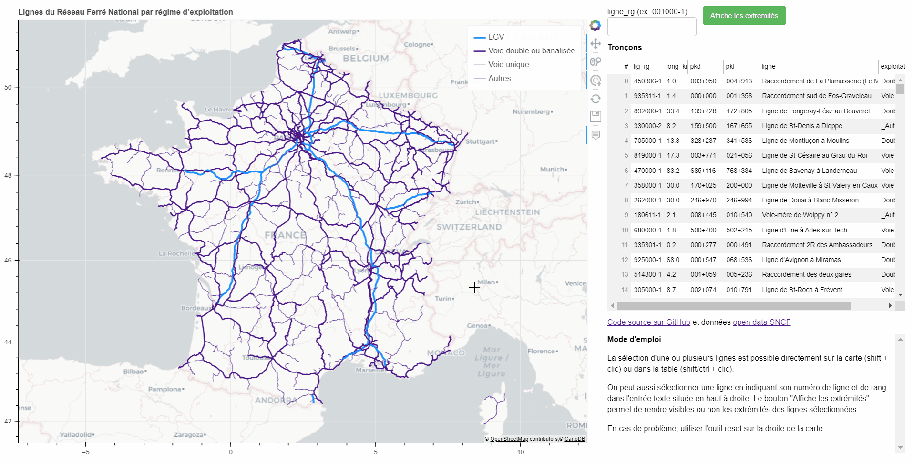

# Cartographie

`cartographie` rassemble des cartes dynamiques créées à partir des données de l'infrastructure ferroviaire tirées de [l'open data SNCF](https://data.sncf.com/). Le code Python (3.9) s'appuie principalement sur les bibliothèques [bokeh](https://bokeh.org/) et [geopandas](https://geopandas.org/).

## Démo

[cartographie](https://efbulle.github.io/cartographie/)

Merci à GitHub Pages !

## Captures d'écran

## Utilisation et exemples

Le fichier `cartes.py` contient les classes utiles et le répertoire [notebooks](notebooks) illustre un exemple d'utilisation, d'autres suivent...

